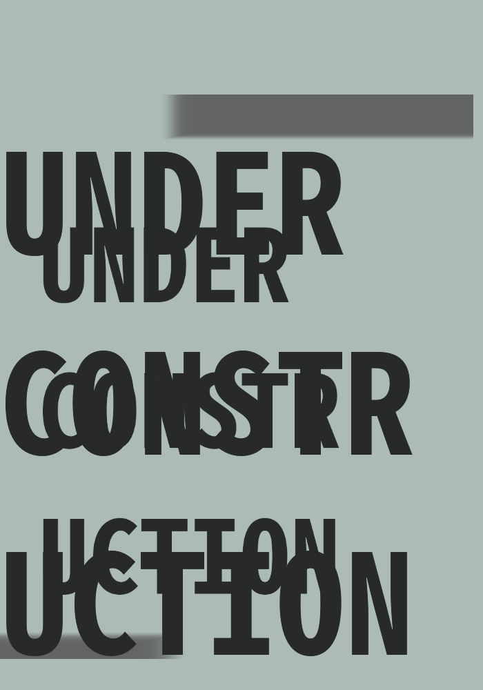

Original Idea [Molly White](https://www.mollywhite.net)'s [@allmybotsgone](https://github.com/molly/allmybotsgone)
---

# [@lostminebotstoo](https://twitter.com/lostminebotstoo)

)

An attempt to learn more about the tweepy API, Flask webhooks, and the implementation of twitter bots.
I've used [Molly White](https://www.mollywhite.net)'s original idea of [@allmybotsgone](https://github.com/molly/allmybotsgone) as the model for the implementation.

